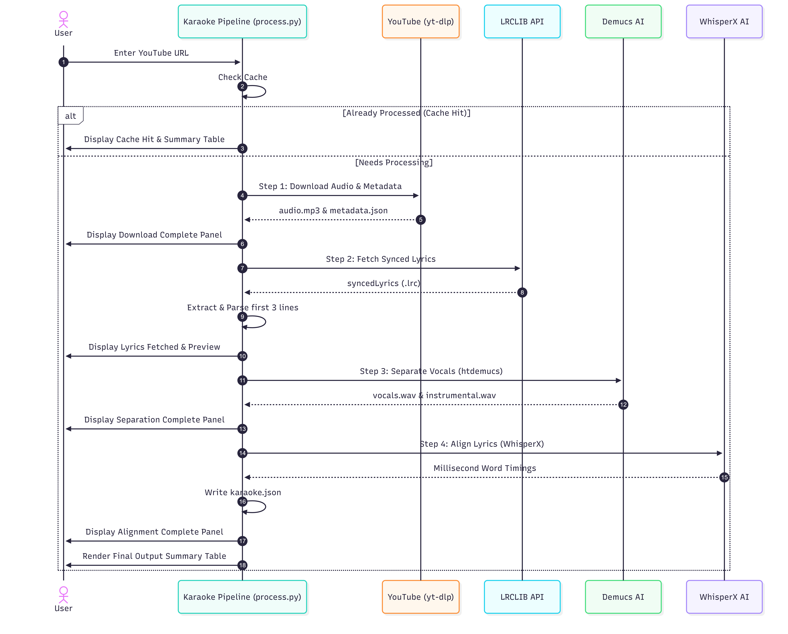

# 🎤 SingAlongSync

A high-fidelity command-line utility to obtain **word-by-word lyrics sync like Apple Music using open-source WhisperX and synced lyrics from LRCLIB**. 

It automatically downloads YouTube audio, isolates vocal and instrumental tracks, fetches synced lyrics, and aligns word timings at the millisecond level using deep learning. Powered by a premium, interactive terminal user interface (TUI).

> [!TIP]
> **How to obtain word-by-word Apple Music Sing-Along-like lyrics?**
> This repository is a direct answer to that search. By combining high-performance vocal separation with **WhisperX phonetic alignment** and synced lyrics from the **LRCLIB API**, it computes exact millisecond-level word timings. Use the resulting `karaoke.json` to power real-time color-sweeping lyrics in web apps, video editors, or custom karaoke engines.

---

## ✨ Features

- **High-Quality Audio Downloading:** Leverages `yt-dlp` and `ffmpeg` to extract the best audio track (320kbps MP3) and download metadata.
- **Synced Lyrics Extraction:** Automatically queries [LRCLIB](https://lrclib.net/) to locate and pull time-synced lyrics (`.lrc`).
- **AI-Powered Vocal Separation:** Uses the **Demucs** (`htdemucs`) neural network model to split audio into pure vocals and pristine instrumental stems.
- **Word-Level Audio Alignment:** Uses **WhisperX** to perform phonetic forced alignment, matching individual words to precise millisecond intervals.
- **Premium Rich TUI:** Features gradient welcome titles, status spinners for heavy computations, interactive live progress tracking, colorized warnings, lyric previews, and detailed output tables showing file properties and sizes.
- **Apple Music-Style Web UI:** Includes a premium, glassmorphism single-page web app built with dynamic ambient backdrops (extracting colors from cover art), smooth vertical center-scrolling lyrics, click-to-seek lyric interaction, and a dynamic song library view to switch between all processed tracks seamlessly.
- **Intelligent Caching:** Instantly checks for previously processed tracks to avoid redundant downloads or heavy model executions.

---

## 📺 Demonstration Videos

Watch the demonstration videos below to see **SingAlongSync**'s CLI processing and premium Web UI Player in action:

### 🌐 1. Web UI Apple Music Karaoke Player
Shows the dynamic song library, canvas color-extraction backdrops, and fluid word-by-word sweeping highlights:

<video src="https://github.com/user-attachments/assets/1bc74b87-c34e-4b5f-b07e-c3dec88071e0" controls width="100%"></video>

_Direct link: [Watch Web UI Demo directly in your browser](https://github.com/user-attachments/assets/1bc74b87-c34e-4b5f-b07e-c3dec88071e0)_

### 💻 2. CLI / TUI Processing Stage
Shows how you process songs in the terminal using the rich TUI:

<video src="https://github.com/user-attachments/assets/317f310f-c52e-434c-95ad-9657a1131856" controls width="100%"></video>

_Direct link: [Watch TUI Demo directly in your browser](https://github.com/user-attachments/assets/317f310f-c52e-434c-95ad-9657a1131856)_

---

## ⚙️ How It Works (Sequence Diagram)

Below is the dynamic flow of how **SingAlongSync** securely processes your audio files and syncs lyrics:



---

## 🛠️ The Pipeline Workflow

1.  **Step 1: Download** — Downloads audio to `audio.mp3` and compiles metadata into `metadata.json`.
2.  **Step 2: Fetch Lyrics** — Downloads the synced `.lrc` file and displays a terminal preview of the first few lines of lyrics.
3.  **Step 3: Separate Vocals** — Splits audio into `vocals.wav` and `instrumental.wav` stems.
4.  **Step 4: Align Lyrics** — Computes precise start/end timings for every word in the song, writing the sync data to `karaoke.json`.

---

## 📂 Output File Structure

For every processed YouTube URL, a dedicated directory is generated inside `downloads/<video_id>/` containing the following files:

```
downloads/<video_id>/
├── audio.mp3          # Original high-quality track
├── metadata.json      # Video details (title, artist, duration, thumbnail)
├── synced.lrc         # Synced LRC format lyrics file
├── vocals.wav         # Demucs-separated clean vocal stem
├── instrumental.wav   # Demucs-separated instrumental stem
├── karaoke.json       # WhisperX millisecond word-level timing database
└── status.json        # Pipeline stage execution log
```

### 📄 Detailed File Schemas & Contents

#### 1. `karaoke.json` (Word-Level Timing Database)
This is the core output required for **Apple Music Sing-Along-style visual sweeps**. It contains an array of lines, with each line holding a nested list of individual words mapped to their precise starting and ending timestamps (in seconds, rounded to 3 decimal places):

```json
[
  {
    "line": "La da, la da da, la la la",
    "start": 3.721,
    "end": 7.119,
    "words": [
      {
        "word": "La",
        "start": 3.721,
        "end": 3.983
      },
      {
        "word": "da,",
        "start": 4.204,
        "end": 4.626
      },
      {
        "word": "la",
        "start": 4.666,
        "end": 4.908
      }
    ]
  }
]
```

#### 2. `metadata.json` (Track Info)
Contains metadata extracted from YouTube via `yt-dlp` used for cataloging:

```json
{
  "videoId": "eZCWyFNV_ZM",
  "title": "Sunroof",
  "artist": "Nicky Youre, hey daisy",
  "album": "",
  "duration": 163,
  "thumbnail": "https://i.ytimg.com/vi/eZCWyFNV_ZM/hqdefault.jpg"
}
```

#### 3. `synced.lrc` (Synced LRC Lyrics)
Standard synchronized lyrics file fetched from LRCLIB. Timestamps are line-level:

```text
[00:03.72] La da, la da da, la la la
[00:07.11] La da, la da di da da, la la la la la
[00:10.51] La da, la da da, la la la
```

#### 4. `status.json` (Pipeline Progress Logs)
Tracks completion states and pipeline milestones:

```json
{
  "stage": "complete",
  "progress": 0,
  "downloaded": true,
  "lyrics_found": true,
  "separated": true,
  "aligned": true
}
```

#### 5. Audio Assets
*   `audio.mp3`: High-quality 320kbps MP3 transcode of the original downloaded YouTube stream.
*   `vocals.wav`: isolated vocal track (uncompressed WAV, 44.1kHz) separated via the Demucs deep-learning source separation engine. Ideal for forced alignment engines or vocal training.
*   `instrumental.wav`: backing/instrumental track (uncompressed WAV, 44.1kHz) separated via Demucs. Ideal for direct karaoke sing-along playback.

---

## 🚀 Installation & Usage

### Prerequisites

Ensure you have the following installed on your system:
- Python $\ge$ 3.11
- [FFmpeg](https://ffmpeg.org/) (required by `yt-dlp` and `demucs` for audio transcoding)
- CUDA-compatible GPU (highly recommended for high-speed Demucs stem-splitting and WhisperX word-alignment, though it will fall back to CPU)

### Setup

Clone this repository and sync the dependencies using `uv` (a fast Python package installer):

```bash
# Sync dependencies and set up virtual environment
uv sync
```

### Running the Tool

You can run the pipeline interactively:

```bash
uv run python process.py
```

Or pass the YouTube/YouTube Music URL directly as an argument:

```bash
uv run python process.py "https://music.youtube.com/watch?v=eZCWyFNV_ZM"
```

---

## 💻 Tested Hardware

**SingAlongSync** has been tested and verified to run with full **NVIDIA CUDA acceleration** for rapid deep-learning audio splitting (Demucs) and lyric alignment (WhisperX).

### Verified Test Environment:
- **GPU:** NVIDIA GeForce RTX 4050 Laptop GPU (6GB GDDR6 VRAM)
- **CUDA Version:** CUDA `13.1` (Driver `591.86`)
